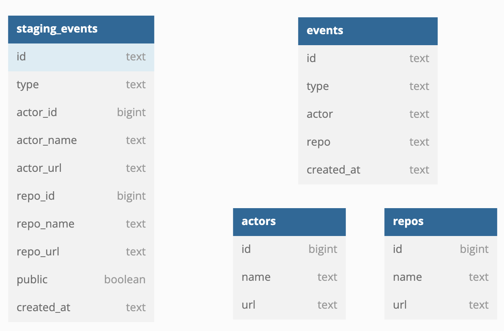
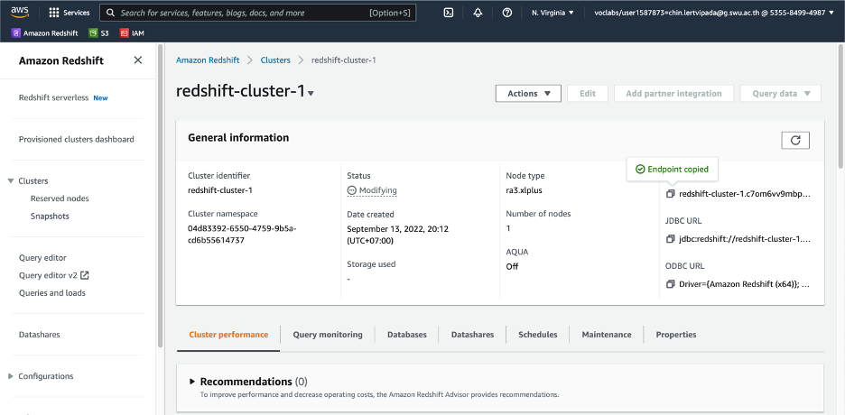
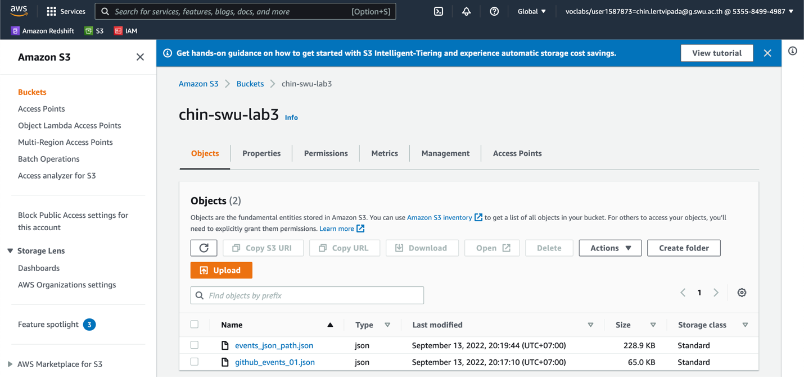
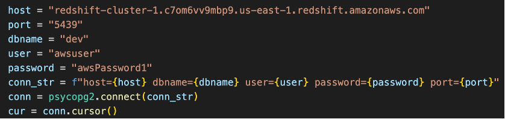
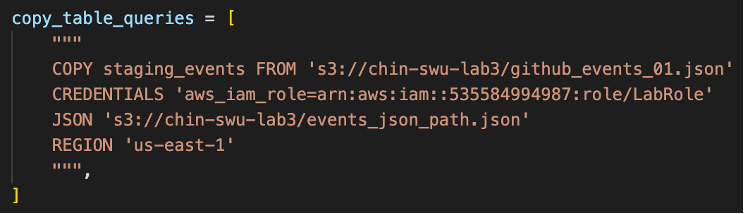

# Building a Data Warehouse

## Data model

<br>

## Documentation
[Documentation](https://github.com/chin-lertvipada/swu-ds525/blob/f488152fb40274e07f5a9baf0ebedd523fbaa8ec/03-building-a-data-warehouse/Doc/Week%203%20-%20Building%20dwh%20-%20Summary.pdf)
<br>
__________
<br>

## Project implementation instruction
<br>


### 1. change directory to project 02-data-modeling-ii:
```sh
$ cd 03-building-a-data-warehouse
```

### 2. create visual environment named 'ENV' (only 1st time):
```sh
$ python -m venv ENV
```

### 3. activate the visual environment:
```sh
$ source ENV/bin/activate
```

### 4. install required libraries from config file (only 1st time): 
```sh
$ pip install -r requirements.txt
```

### 5. Create AWS Redshift cluster (with following config):
```sh
- 'Cluster identification'  : redshift-cluster-1
- 'Cluster for'             : Production
- 'Node type'               : ra3.xlplus
- 'AQUA'                    : Turn off
- 'Number of nodes'         : 1
- 'Database username'       : awsuser
- 'Database password'       : awsPassword1
- 'Cluster permission'      : LabRole
- 'Remaining'               : keep as default
```
**!! Don't forget !! - Enable public access to AWS RedShift**
<br>


<br>

<br>

### 6. Upload data file and manifest file to AWS S3:
&nbsp;&nbsp;&nbsp;a. Create AWS S3 bucket with ‘Full public access’ <br>
&nbsp;&nbsp;&nbsp;b.	Upload files <br>
&nbsp;&nbsp;&nbsp;&nbsp;&nbsp;&nbsp;- Manifest file : events_json_path.json <br>
&nbsp;&nbsp;&nbsp;&nbsp;&nbsp;&nbsp;- Data file : github_events_01.json


<br>

<br>

### 7. Config ‘etl.py’ to connect to AWS Redshift:
&nbsp;&nbsp;&nbsp;a. Host : copy from AWS Redshift endpoint <br>
&nbsp;&nbsp;&nbsp;b. Port : 5439 <br>
&nbsp;&nbsp;&nbsp;c. Dbname : dev <br>
&nbsp;&nbsp;&nbsp;d. User/Password : as define when create the cluster 

<br>

<br>

### 8. Config ‘etl.py’ to copy the data from AWS S3 to AWS Redshift:
&nbsp;&nbsp;&nbsp;a. From : the URI to data file <br>
&nbsp;&nbsp;&nbsp;b. Credentials : the ARN of LabRole <br>
&nbsp;&nbsp;&nbsp;c. Json : the URI to manifest file <br>

<br>

### 9. Create tables, Inject data from S3 to Redshift, Insert data, Query data thru python script, named ‘etl.py’:
```sh
$ python etl.py
```

<br>

### 10.	Check the data in cluster by ‘query editor’ (exported as csv):
&nbsp;&nbsp;[staging_events](https://github.com/chin-lertvipada/swu-ds525/blob/1493a0cd6e0d75c1df18463aa85d11cb7effb3a8/03-building-a-data-warehouse/Doc/result/staging_events.csv) <br>
&nbsp;&nbsp;[events](https://github.com/chin-lertvipada/swu-ds525/blob/1493a0cd6e0d75c1df18463aa85d11cb7effb3a8/03-building-a-data-warehouse/Doc/result/events.csv) <br>
&nbsp;&nbsp;[actors](https://github.com/chin-lertvipada/swu-ds525/blob/1493a0cd6e0d75c1df18463aa85d11cb7effb3a8/03-building-a-data-warehouse/Doc/result/actors.csv) <br>
&nbsp;&nbsp;[repos](https://github.com/chin-lertvipada/swu-ds525/blob/1493a0cd6e0d75c1df18463aa85d11cb7effb3a8/03-building-a-data-warehouse/Doc/result/repos.csv)

<br>

## Shutdown steps

### 11. deactivate the visual environment:
```sh
$ deactivate
```

<br>

### 12. Delete the AWS Redshift cluster

<br>

### 13. Delete the files and bucket in AWS S3